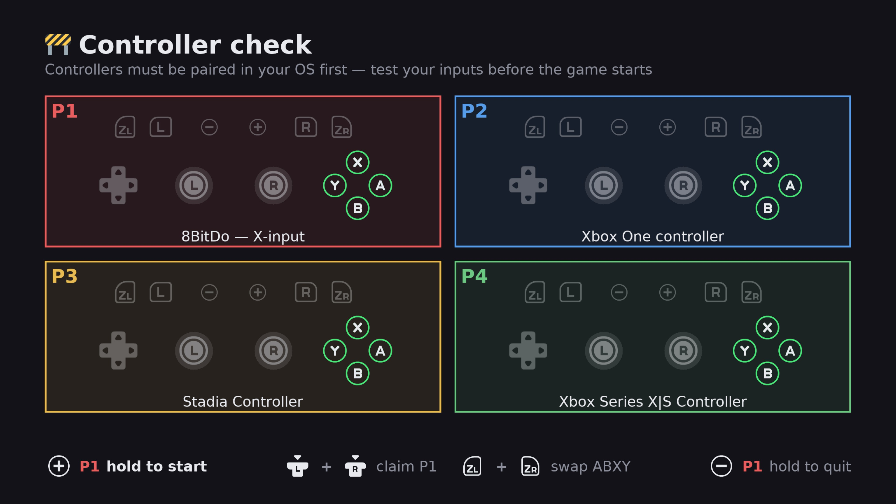

<div align="center">

# Preflight

Check every controller works — *before* the game starts. Built as [SelfSteam](https://github.com/ScarletPachydermDev/SelfSteam) complement



</div>

##

Built for Steam Machine or Deck in a living room for multiplayer games, aimed squarely at not making other
players wait while you work out whose controller is which and inputs work. Just install emulator and link preflight with emulator game file launch command.

## Inject configs to emulators with:

- How many controllers are connected, and which player each one is
- Every emulated console button, both sticks, d-pad and both triggers, live
- That A means A — or the mirrored layout if you prefer. WSIWYG.
- That no two players end up on the same controller
- That the config it writes has no missing bindings — a blank stick in the
  emulator's saved settings is otherwise invisible until the game starts

## Supported emulators

| Emulator | Builds | What Preflight writes |
|:---|:---|:---|
| **Ryubing (Ryujinx)** | flatpak, AppImage, tar | all four players' bindings, as Pro Controllers |
| **Dolphin** | flatpak | GameCube controller only |
| **Wheel Wizard** | Flatpak, native Linux build | writes Dolphin's GameCube pads before Wheel Wizard launches it |
| **Eden** | flatpak, AppImage | all four players' bindings, as Pro Controllers — needs Steam Input **on** |
| **Cemu** | flatpak | all four players: P1 a Wii U GamePad or Pro Controller (**+** and **−** on the check screen, remembered per game), the rest Pro Controllers |
| **gopher64** | flatpak | all four players' bindings, as N64 pads — and enables ports 2-4, which gopher64 ships disabled |
| **DuckStation** | AppImage | all four players' bindings, as DualShocks with rumble — and turns the multitap on for three or more — needs Steam Input **on** |
| **xemu** | flatpak | all four players' bindings, as Xbox controllers, by each pad's own id |
| **PCSX2** | flatpak | all four players' bindings, as DualShock 2s with rumble — and turns the multitap on for three or more |

## Requirements

- SteamOS or a Linux system with Steam
- One of the emulators above
- SDL2 and SDL2_ttf — already present on SteamOS
- `unsquashfs` for AppImage builds — already present on SteamOS

No Python packages to install. SteamOS has no `pip` and a read-only `/usr`, so
Preflight talks to the libraries already on the system.

### About Steam Input

With Steam Input on, every controller is presented to the game as an identical
Valve virtual pad. That used to make them impossible to tell apart. Preflight
works around it by reading the physical devices Steam hides and matching each
one to its virtual counterpart, so your controllers keep their real names and
their own settings.

The Steam Controller in particular *only* exists through Steam Input — with it
off, that pad reaches Preflight but never reaches the emulator.

Though tool can be used without Steam input if you prefer.

## How to use

Preflight wraps flatpak and appimages launch commands that would start your game. 
```
~/preflight/preflight.sh -- flatpak run io.github.ryubing.Ryujinx -f "/run/media/deck/mSD/ROMs/Switch/game.nsp"
```
or enable it at [SelfSteam](https://github.com/ScarletPachydermDev/SelfSteam) from the Emulators tab on supported emulators


### Where things live

Nothing you own sits next to the code, so the install folder can be replaced
wholesale by an update without losing anything:

| `~/.config/preflight/` | `theme.json`, `games.json` — yours to edit |
|:---|:---|
| **`~/.local/state/preflight/`** | **`known_pads.json`, `launch.log`, config backups, reports** |
| **the install folder** | **code and shipped defaults only** |

On first run Preflight moves any older state out of the install folder and
takes a copy of the shipped `theme.json` and `games.json` for you, so nothing
is lost on the way. Set `PREFLIGHT_STATE_DIR` or `PREFLIGHT_CONFIG_DIR` to put
them somewhere else; otherwise the usual `XDG_*` variables are honoured.

Colours and rumble pacing live in `~/.config/preflight/theme.json`.

## Limitations

- A controller asleep during the check gets no binding at all.
- Every player is set up as a Pro Controller; handheld and Joy-Con pair are not
  configurable here.
- On Dolphin only GameCube pads are written. Wii remotes are left alone.
- Eden needs Steam Input **on**. With it off the bindings are written but
  the game gets no input, for reasons that are not yet understood —
  Preflight spots that case and says so on screen before the game starts.
- If a pad sleeps or wakes in the moment between saving and the emulator
  starting, its assignment can shift.
- Preflight don't pair controllers. Pair them in your OS first.
- On Dolphin a pad is bound by its kernel device name, so Preflight has to be
  able to read that pad's node. A controller SDL can see does not always have
  one: Steam takes the 2026 Steam Controller over at hidraw level and publishes
  only a virtual pad, which leaves Dolphin nothing to bind to. That pad also
  arrives already remapped — L and both back paddles came through as d-pad up
  — so it is the one controller where the check screen cannot show you the
  truth about its shoulders. Every other pad maps L to Z in the game exactly
  as written.

## Troubleshooting

`~/.local/state/preflight/launch.log` records each run. If it ends at `window ready`, Preflight
started fine and the problem is elsewhere. If there is no entry at all, Steam
never launched it — Steam sometimes believes a shortcut is still running and
the Play button silently does nothing, which a Steam restart clears.

`tools/stage-art.py` rebuilds the button glyphs from Kenney's pack: the
GameCube set, and two derived layers for the Switch set from the art already
committed. It is safe to run twice.

`shot.py` renders the check screen to a PNG instead of the TV, which is how
a layout change gets checked: `./shot.py out.png --pads 4`. It can draw either
map (`--layout gamecube`) and fake any input, so a pressed button or a stick at
full deflection can be looked at without a controller in reach:
`./shot.py out.png --pads 1 --press 1:a,start --axes 1:0=-32768`.

The log also records **what the pad actually sent** — every press as SDL
delivered it, and the first time each axis moves:

```
press: P1 btn=11 (D-Up)
axis:  P1 axis=4 (Trigger L) reached 27312
```

That is the diagnostic for "this button does the wrong thing". Steam Input
sits between the pad and Preflight, and a per-game layout can bind a shoulder
to something else entirely — seen for real: a Steam Controller whose L1 and
both back paddles all arrived as `btn=11 (D-Up)`, so Z never lit. Preflight is
showing exactly what it receives; the binding is Steam's, and the only place
to change it is that shortcut's controller layout (Steam's per-game controller
settings — switching it to a plain **Gamepad** template binds the shoulders as
shoulders). Note Dolphin is bound to the physical device through evdev, so a
remapped pad can look wrong here and still play correctly.

`tools/steam-shortcut.py` lists Steam's non-Steam shortcuts and can put a
launcher in front of one, reading and rewriting `shortcuts.vdf` in place with a
byte-identical round-trip check and a timestamped backup. Useful when checking
what a shortcut actually runs; SelfSteam is what creates them normally.

`phase0.py` is a standalone diagnostic that prints every controller the system
can see, how the emulator will identify it, and whether Steam is intercepting.
Run it if something looks wrong and you want the full picture.

## Credits

Button art is [Kenney](https://kenney.nl)'s *Input Prompts* (CC0).

Built with [Claude Code](https://claude.com/claude-code).
