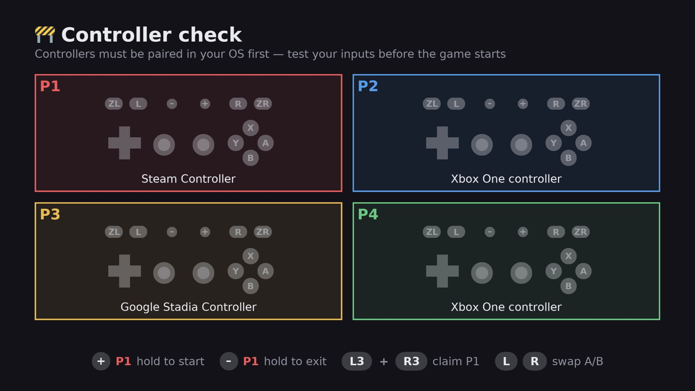

<div align="center">

# Preflight

Check every controller works — *before* the game starts. Built as [SelfSteam](https://github.com/ScarletPachydermDev/SelfSteam) complement



</div>

---
**Are you TIRED of being Player 3 in your own living room?**

Sick of pressing **A** and getting **B**? Of a left stick that works perfectly
everywhere *except* in the game? Of one controller somehow driving two players
at once, while a third pad you definitely turned on does nothing at all?

Have you ever sat down with three friends, started a race, and discovered that
Bluetooth quietly decided tonight's player order while you were making tea?

> *"I pair them in the same order EVERY TIME."*
> — you, moments before it happens again

Preflight sits between your Steam shortcut and the emulator.
Everyone sees their own controller on screen, presses buttons to confirm they
land where the labels say, and feels a rumble telling them which player they
are. When it all looks right, Player 1 holds `+` and the game starts.

It writes the emulator's controller config on the way through, so what you see
on the check screen is what the game actually gets.

No more troubleshooting while three people wait. **No more you being Player 3.**

## Notes

Built for Steam Machine or Deck in a living room, aimed squarely at not making three
people wait while you work out whose controller is which and inputs work.

**Currently supports only Ryubing (Ryujinx) flatpak.** Ryubing appimage, Dolphin and Eden are planned 

## Requirements

- SteamOS or a Linux system with Steam
- Ryubing (Ryujinx) installed as a Flatpak
- SDL2 and SDL2_ttf — already present on SteamOS

No Python packages to install. SteamOS has no `pip` and a read-only `/usr`, so
Preflight talks to the libraries already on the system.

### About Steam Input

With Steam Input on, every controller is presented to the game as an identical
Valve virtual pad. That used to make them impossible to tell apart. Preflight
works around it by reading the physical devices Steam hides and matching each
one to its virtual counterpart, so your controllers keep their real names and
their own settings.

The Steam Controller in particular *only* exists through Steam Input — with it
off, that pad reaches Preflight but never reaches the emulator.

Though tool can be used without Steam input if you prefer.

## How to use

Preflight wraps the command that would have started your game. Without it you
would run something like:

```bash
flatpak run io.github.ryubing.Ryujinx -f "/run/media/deck/mSD/ROMs/Switch/game.nsp"
```

With it, put `preflight.sh --` in front of exactly that:

```bash
~/preflight/preflight.sh -- flatpak run io.github.ryubing.Ryujinx -f "/run/media/deck/mSD/ROMs/Switch/game.nsp"
```

| Command | What it does |
|:---|:---|
| `preflight.sh -- <command>` | check controllers, then run that command |
| `preflight.sh "<rom>"` | shorthand: check, then launch that ROM in Ryujinx |
| `preflight.sh` | check, then open the Ryujinx game list |
| `preflight.sh --dry-run "<rom>"` | everything except writing config and launching |
| `preflight.py --version` | print the version and exit |

Keep the quotes around ROM paths — they have spaces in them.

**If Preflight has no backend for what you point it at**, it says so on screen,
runs the check anyway and still launches. You get the "who is holding what"
screen in front of any emulator; you just do not get its bindings written.
Ryubing (Ryujinx) is the only backend today.

Each run writes its version and what it was asked to launch to
`~/.local/state/preflight/launch.log`.

### Where things live

Nothing you own sits next to the code, so the install folder can be replaced
wholesale by an update without losing anything:

| `~/.config/preflight/` | `theme.json`, `games.json` — yours to edit |
|:---|:---|
| **`~/.local/state/preflight/`** | **`known_pads.json`, `launch.log`, config backups, reports** |
| **the install folder** | **code and shipped defaults only** |

On first run Preflight moves any older state out of the install folder and
takes a copy of the shipped `theme.json` and `games.json` for you, so nothing
is lost on the way. Set `PREFLIGHT_STATE_DIR` or `PREFLIGHT_CONFIG_DIR` to put
them somewhere else; otherwise the usual `XDG_*` variables are honoured.

## Using it

There is one screen, and **taps do nothing** — so everyone can mash buttons to
test them without setting anything off. Every action is a hold or a combo:

| `+` hold | Player 1 starts the game |
|:---|:---|
| **`−` hold** | **anyone exits** |
| **`L3`+`R3`** | **claim Player 1 — once per session** |
| **`L`+`R`** | **mirror your own A/B and X/Y** |

Player slots follow the order controllers wake up. Whoever is on first is
Player 1; `L3`+`R3` takes that spot if you are not. It locks after one use so
nobody can keep taking it back.

ABXY are Nintendo controller layout and is set by default WSIWYG,
press the button marked A and the circle marked A lights. If you would rather match physical position than labels, `L`
+`R` mirrors it for your pad only, and Preflight remembers.

Colours and rumble pacing live in `~/.config/preflight/theme.json`.

## What it checks

- How many controllers are connected, and which player each one is
- Every button, both sticks, the d-pad and both triggers, live
- That A means A — or the mirrored layout if you prefer. WSIWYG.
- That no two players end up on the same controller
- That the config it writes has no missing bindings — a blank stick in the
  emulator's saved settings is otherwise invisible until the game starts

## Limitations

- A controller asleep during the check gets no binding at all.
- Every player is set up as a Pro Controller; handheld and Joy-Con pair are not
  configurable here.
- If a pad sleeps or wakes in the moment between saving and the emulator
  starting, its assignment can shift.
- Preflight don't pair controllers. Pair them in your OS first.

## Troubleshooting

`~/.local/state/preflight/launch.log` records each run. If it ends at `window ready`, Preflight
started fine and the problem is elsewhere. If there is no entry at all, Steam
never launched it — Steam sometimes believes a shortcut is still running and
the Play button silently does nothing, which a Steam restart clears.

`phase0.py` is a standalone diagnostic that prints every controller the system
can see, how the emulator will identify it, and whether Steam is intercepting.
Run it if something looks wrong and you want the full picture.


